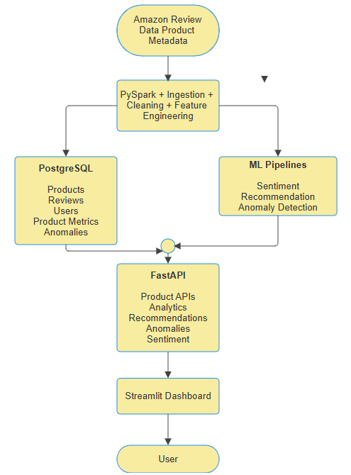

# MarketPulse ML Platform

An end-to-end machine learning platform for e-commerce intelligence, built around large-scale review processing, product analytics, recommendation, anomaly detection, and sentiment analysis.

MarketPulse takes raw Amazon product and review data through a complete data and ML pipeline:

**Raw Data → PySpark Processing → Feature Engineering → ML Models → PostgreSQL → FastAPI → Streamlit**

The platform is containerized with Docker and deployed using Render, Neon PostgreSQL, and Streamlit Community Cloud.

---

## Overview

MarketPulse was built to demonstrate how an ML system moves beyond model training into a complete production-oriented application.

The project combines:

* Large-scale data processing with PySpark
* Feature engineering for product, review, and user-level data
* PostgreSQL data storage
* Machine learning for sentiment analysis
* Content-based product recommendation
* Product-level anomaly detection
* REST APIs with FastAPI
* Interactive visualization with Streamlit
* Docker-based development and deployment
* Automated testing
* Cloud deployment

The primary dataset is the **Amazon 2023 All_Beauty** dataset containing product reviews and product metadata.

---

## Production Architecture



### Production deployment

```text
Streamlit Community Cloud
            │
            ▼
      Render FastAPI
            │
            ▼
     Neon PostgreSQL
```

The Streamlit application communicates with the deployed FastAPI service through `API_BASE_URL`. FastAPI accesses the production PostgreSQL database through `DATABASE_URL`.

---

## Key Features

### 1. Large-scale data processing

PySpark is used to process Amazon review and product metadata.

The pipeline performs:

* Data ingestion
* Cleaning
* Timestamp processing
* Review-level feature engineering
* Product-level aggregation
* User-level aggregation
* Database loading

---

### 2. Product analytics

MarketPulse calculates product-level metrics including:

* Review count
* Average rating
* Rating standard deviation
* Positive review ratio
* Negative review ratio
* Average helpful votes
* Review velocity
* Unique user count

These metrics are stored in PostgreSQL and exposed through the API.

---

### 3. Sentiment analysis

A supervised text classification pipeline predicts whether a review is positive or negative.

The target is derived from the review rating:

```text
rating >= 3.5 → positive
rating <  3.5 → negative
```

The model pipeline uses:

```text
Text
 ↓
Text normalization
 ↓
TF-IDF
 ↓
Logistic Regression
 ↓
Sentiment prediction
```

The trained sentiment model is exposed through the FastAPI `/sentiment` endpoint.

### Model performance

| Metric    |  Score |
| --------- | -----: |
| Accuracy  | 0.8911 |
| Precision | 0.8893 |
| Recall    | 0.8911 |
| F1 Score  | 0.8894 |

---

### 4. Content-based recommendation

MarketPulse provides product recommendations using content-based similarity.

Product information is represented using:

* Product title
* Main product category

The recommendation pipeline uses TF-IDF representations with a maximum vocabulary size of 10,000 features.

For a selected product, the system compares its representation with the product corpus and returns similar products.

The recommendation model is packaged as a serialized model artifact and loaded by the FastAPI service.

---

### 5. Product anomaly detection

Anomaly detection is performed at the product level using an Isolation Forest model.

The model identifies products whose feature patterns differ substantially from the rest of the product population.

The resulting anomaly predictions are stored in PostgreSQL and exposed through the API.

The production dataset contains anomaly results for approximately 112,565 products.

---

## Technology Stack

### Data Engineering

* Python
* PySpark
* Apache Spark
* PostgreSQL

### Machine Learning

* scikit-learn
* NumPy
* pandas
* TF-IDF
* Logistic Regression
* Isolation Forest

### Backend

* FastAPI
* SQLAlchemy
* Pydantic
* Uvicorn

### Frontend

* Streamlit

### Infrastructure

* Docker
* Docker Compose
* Render
* Neon PostgreSQL
* Streamlit Community Cloud

### Testing

* pytest

### Development

* Git
* GitHub
* WSL/Linux

---

## Project Structure

```text
```
📁 marketpulse-ml-platform/
    ├── 📁 api/
    │   ├── 📁 routes/
    │   │   ├── 📄 __init__.py
    │   │   ├── 📄 anomalies.py
    │   │   ├── 📄 products.py
    │   │   ├── 📄 recommendations.py
    │   │   └── 📄 sentiment.py
    │   ├── 📄 __init__.py
    │   ├── 📄 dependencies.py
    │   ├── 📄 main.py
    │   └── 📄 schemas.py
    ├── 📁 dashboard/
    │   ├── 📄 __init__.py
    │   ├── 📄 api_client.py
    │   ├── 📄 app.py
    │   ├── 📄 Dockerfile
    │   └── 📄 requirements.txt
    ├── 📁 ml/
    │   ├── 📄 anomaly.py
    │   ├── 📄 build_recommendations.py
    │   ├── 📄 preprocessing.py
    │   ├── 📄 recommendations.py
    │   ├── 📄 sentiment.py
    │   └── 📄 train.py
    ├── 📁 spark/
    │   ├── 📄 clean.py
    │   ├── 📄 features.py
    │   ├── 📄 ingest.py
    │   ├── 📄 load_anomalies.py
    │   └── 📄 load_to_postgres.py
    ├── 📁 tests/
    │   ├── 📄 __init__.py
    │   ├── 📄 test_api.py
    │   ├── 📄 test_database.py
    │   └── 📄 test_ml.py
    ├── 📄 .dockerignore
    ├── 📄 .gitignore
    ├── 📄 db.py
    ├── 📄 docker-compose.yml
    ├── 📄 Dockerfile
    ├── 📄 preprocessing.py
    ├── 📄 README.md
    └── 📄 requirements.txt

```
```

---

## Data Pipeline

The data pipeline is divided into several stages.

### 1. Ingestion

Raw Amazon review and product metadata files are ingested and converted into processable Spark DataFrames.

### 2. Cleaning

The cleaning stage handles:

* Missing values
* Data type conversion
* Timestamp conversion
* Duplicate handling
* Column selection

### 3. Feature engineering

Review-level features include:

* Review length
* Numeric rating
* Normalized helpful votes
* Review timestamp
* Review year
* Review month
* Review day

Additional product-level and user-level aggregations are generated for downstream analytics and machine learning.

### 4. PostgreSQL loading

Processed datasets and model outputs are loaded into PostgreSQL tables.

Main production tables include:

```text
products
reviews
users
product_metrics
anomalies
recommendations
```

---

## Database

The production database is PostgreSQL hosted on Neon.

The API uses SQLAlchemy to connect to PostgreSQL.

The application supports two database configurations:

### Local development

```text
FastAPI
   ↓
Docker PostgreSQL
```

### Production

```text
FastAPI
   ↓
Neon PostgreSQL
```

The database connection is controlled through the `DATABASE_URL` environment variable in production.

---

## API

The FastAPI backend provides endpoints for interacting with the ML platform.

### Health

```text
GET /health
```

Used for deployment health checks and service monitoring.

### Product

```text
GET /products/{product_id}
```

Returns product information.

### Product analytics

```text
GET /products/{product_id}/analytics
```

Returns product-level review and engagement metrics.

### Recommendations

```text
GET /recommendations/{product_id}
```

Returns content-based product recommendations.

### Anomaly detection

```text
GET /anomalies/{product_id}
```

Returns the stored anomaly prediction and anomaly score for a product.

### Sentiment

```text
POST /sentiment
```

Example request:

```json
{
  "text": "This product is excellent and I really love it."
}
```

Example response:

```json
{
  "text": "This product is excellent and I really love it.",
  "sentiment": "positive",
  "label": 1
}
```

---

## Running Locally

### 1. Clone the repository

```bash
git clone <repository-url>
cd marketpulse
```

### 2. Create a virtual environment

```bash
python3.12 -m venv .venv
source .venv/bin/activate
```

### 3. Install dependencies

```bash
pip install -r requirements.txt
```

### 4. Configure environment variables

For local PostgreSQL development, configure:

```text
MARKETPULSE_DB_PASSWORD
MARKETPULSE_DB_HOST
```

The application defaults to:

```text
MARKETPULSE_DB_HOST=localhost
```

when no host is supplied.

### 5. Start the local stack

```bash
docker compose up -d
```

The local services are:

```text
PostgreSQL → port 5432
FastAPI    → port 8000
Streamlit  → port 8501
```

### 6. Open the dashboard

Open the Streamlit application in your browser.

The dashboard communicates with the FastAPI service through:

```text
API_BASE_URL
```

---

## Running Tests

The project includes tests covering:

* Machine learning components
* API behavior
* Database behavior

Run:

```bash
pytest -q
```

A successful test run should complete with all tests passing.

---

## Docker

The project includes Docker configuration for local full-stack development.

Start the complete stack with:

```bash
docker compose up --build
```

Stop the stack with:

```bash
docker compose down
```

The architecture inside Docker is:

```text
Streamlit
    ↓
FastAPI
    ↓
PostgreSQL
```

---

## Production Deployment

MarketPulse is deployed as three production components:

### Streamlit Community Cloud

Hosts the user-facing dashboard.

### Render

Hosts the FastAPI backend.

### Neon PostgreSQL

Hosts the production relational database.

The production dashboard is configured with:

```text
API_BASE_URL=<deployed FastAPI URL>
```

The production FastAPI service is configured with:

```text
DATABASE_URL=<Neon PostgreSQL connection string>
```

Secrets and connection strings are kept outside the source code.

---

## Model Artifacts

Large trained model artifacts are intentionally not committed to the Git repository.

The repository's `.gitignore` excludes:

```text
models/
data/
mlruns/
artifacts/
```

The production FastAPI Docker image retrieves the required runtime model assets during the image build.

This keeps the source repository lightweight while allowing the deployed API to load its required models.

---

## Testing the Production Application

The production system was tested through the actual Streamlit interface rather than treating the API documentation interface as the primary user test.

The production smoke test covers:

```text
Streamlit Dashboard
       ↓
FastAPI
       ↓
Neon PostgreSQL
```

Tested functionality includes:

* Product lookup
* Product analytics
* Recommendation generation
* Anomaly results
* Sentiment prediction
* API connectivity

---

## Engineering Highlights

This project focuses on the transition from individual machine learning experiments to an integrated ML system.

Key engineering decisions include:

### Separation of concerns

Data processing, machine learning, API logic, database access, and dashboard functionality are separated into dedicated modules.

### Production database abstraction

The application supports local PostgreSQL and production PostgreSQL through environment-based configuration rather than hardcoding connection details.

### Serialized model serving

Trained models are packaged as artifacts and loaded by the API rather than retraining models during API requests.

### Containerized services

Docker provides reproducible environments for the backend, dashboard, and database.

### Production-oriented architecture

The system separates the frontend, API layer, and database so that each component can be developed and deployed independently.

---

## Limitations

Current limitations include:

* The recommendation system is content-based rather than collaborative.
* The sentiment target is derived from ratings rather than manually annotated sentiment labels.
* Model artifacts are managed separately from the source repository.
* The free deployment tiers may introduce cold starts and resource limitations.
* The current dashboard is designed primarily as a portfolio demonstration rather than a high-scale production SaaS application.

---

## Future Improvements

Potential extensions include:

* Collaborative filtering or hybrid recommendation
* More sophisticated NLP models
* Transformer-based sentiment analysis
* Model monitoring and drift detection
* Automated model retraining
* Feature store integration
* MLflow-based production model management
* More comprehensive CI/CD
* Authentication and authorization
* Advanced dashboard analytics
* Caching and performance optimization
* Kubernetes-based deployment for larger workloads

---

## Project Status

**Status: Completed**

The current system includes:

* End-to-end data processing
* Feature engineering
* Machine learning pipelines
* PostgreSQL database
* FastAPI backend
* Streamlit dashboard
* Docker configuration
* Automated tests
* Production deployment
* Production smoke testing

---

## Author

**Abhiyan Paudel**

BSc CSIT student and aspiring AI/ML engineer focused on building production-oriented machine learning systems, AI applications, and intelligent software products.

---

## License

This project is intended as a portfolio and learning project.
